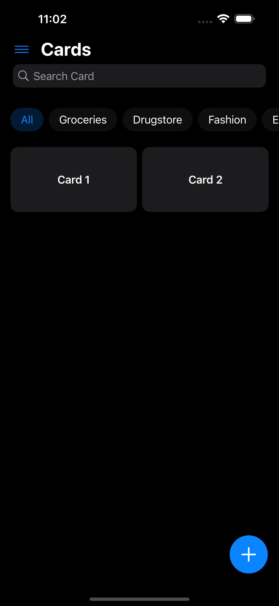
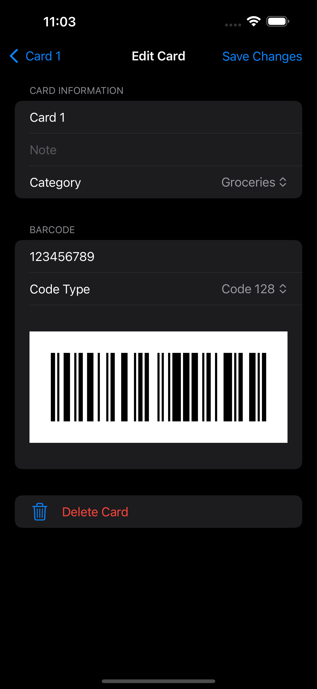
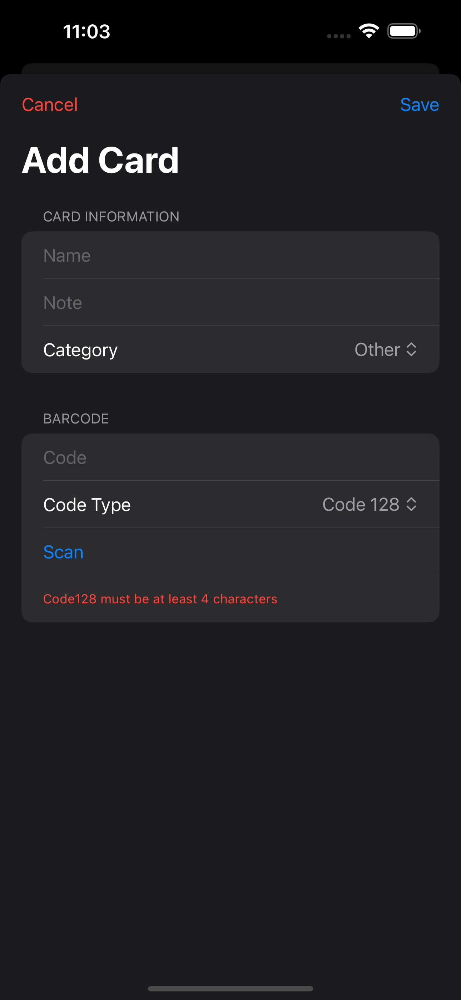

# Felyro

**Felyro** is a simple and privacy-focused iOS app for storing loyalty cards, coupons, and other barcode/QR code-based identifiers. The app is 100% free, with no ads and no data tracking – everything stays on your device.

## ✨ Features

- Save loyalty cards with barcode and QR code
- Share cards between devices
- Works fully offline
- Built with modern SwiftUI for iOS and macOS
- No ads, no analytics, no tracking

## Supported Code Formats

- `Code 128` – versatile 1D barcode format
- `EAN-13`, `EAN-8` – common retail barcodes
- `QR` – 2D QR codes


## 🛠 Requirements

- iOS 17.0+
- Xcode 15+
- Swift 5.9+

## 📸 Screenshots
| Home Screen | Card View | Card Edit | Add Card |
|:-----------:|:---------:|:---------:|:--------:|
|   |  |  |  |

## 🚀 Installation

1. Clone the repository:
   ```bash
   git clone https://github.com/martinhocz/Felyro.git
   ```
2. Open the project in Xcode (`Felyro.xcodeproj`)
3. Build and run on a device or simulator

## 📦 Distribution

The app is available for free on the App Store _(link will be added after approval)_.

## 👥 Contributing

Contributions are welcome! If you want to fix a bug, add a feature, or improve UX, check out [CONTRIBUTING.md](CONTRIBUTING.md) for more information.

## 🛡 License

This project is licensed under the [MIT License](LICENSE).

## 💬 Contact

Martin Horáček  
📧 support@felyro.eu  
🌐 [felyro.eu](https://felyro.eu)

### Credits

- App icon was generated with the help of ChatGPT image generation tools.
